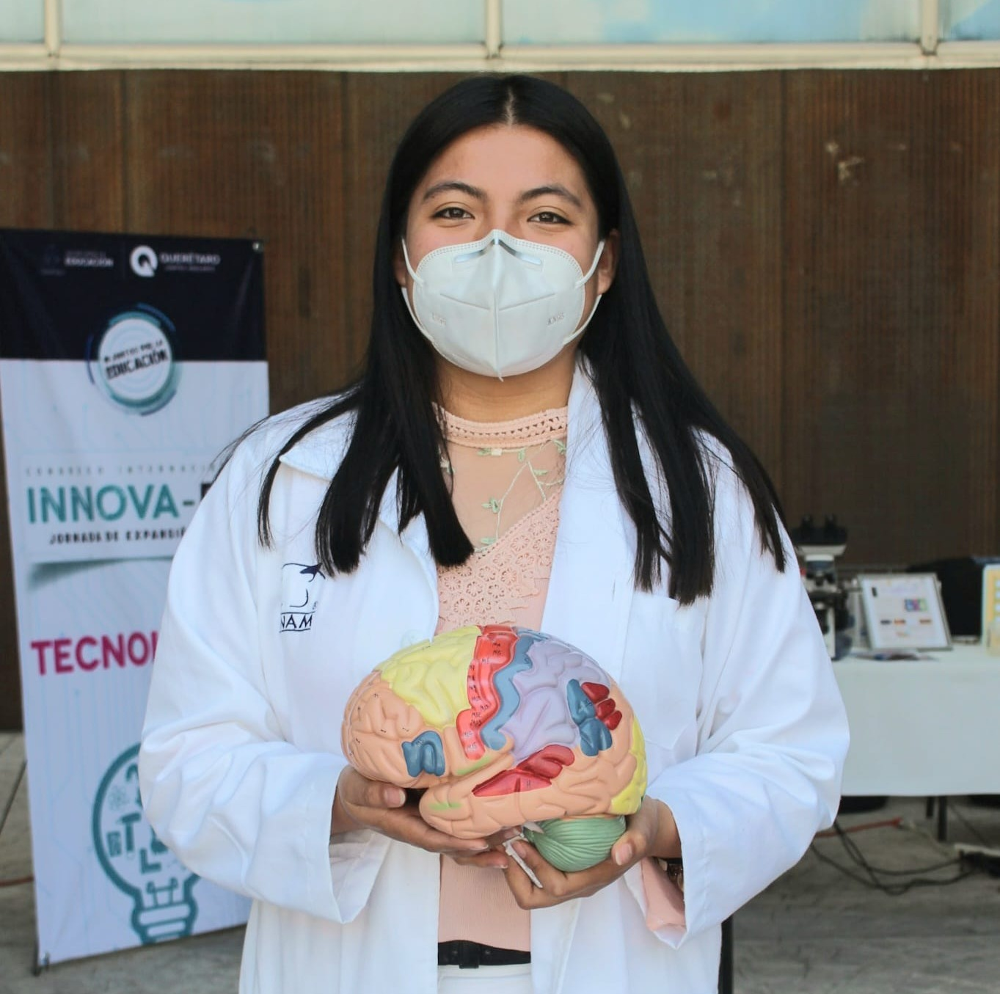

# Hola! Soy Zaira, egresada de la Lic. En Neurociencias en la Escuela Nacional de Estudios Superiores Unidad Juriquilla (ENES Juriquilla) y soy Miembro activo de investigación del grupo Student Interest Group in Neurology - Facultad de Medicina UNAM (SIGN) México.
---

  

---

## Mis Áreas de interés son
- Neurociencia Computacional
- Enfermedades Neurodegenerativas
- Conducta
- Ciencia de Datos

## Tengo experiencia académica en:
**- Practicas Profesionales** 
    **- Instituto de Neurobiologia (INB)** 
        - Participación de Hormonas y Neurotransmisores en el Aprendizaje y la Memoria  
        - Implementación de modelos conductuales en ratones para el estudio de enfermedades neurodegenerativas  
    **- Laboratorio Internacional de Investigación sobre el Genoma Humano (LIIGH)** 
        - MexOmics: registros mexicanos de pacientes 

## Las Herramientas o tecnologías que estoy aprendiendo.
- Python
- R
- GitHub
- FSL
---

## Objetivos académicos o profesionales.
- Egresada de la Lic. en Neurociencias en proceso de titulación, formación activa-independiente de distintas disciplinas en el diseño, implementación y evaluación de sistemas neurotecnológicos que integren principios de control y aprendizaje motor e interacción humano-máquina, orientados a mejorar la función, la rehabilitación y la asistencia en salud mediante soluciones interdisciplinarias.

